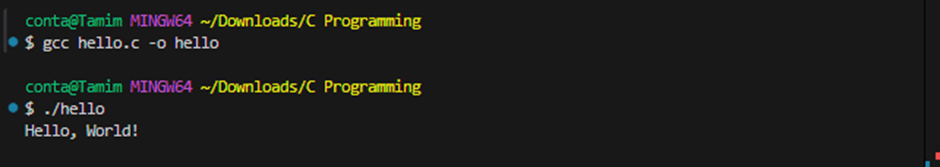
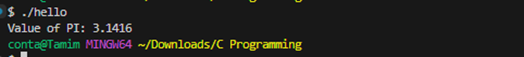
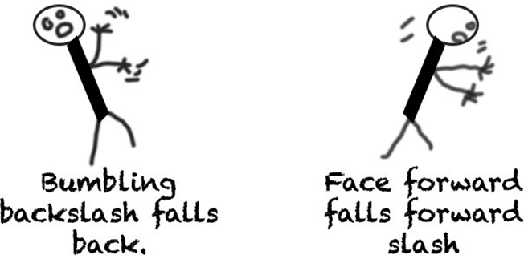
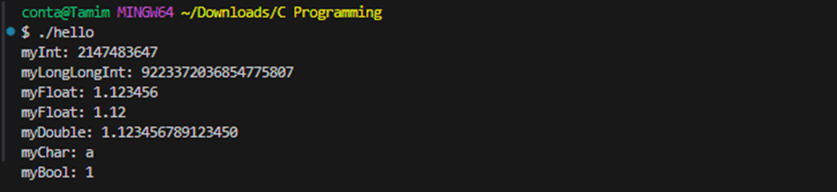
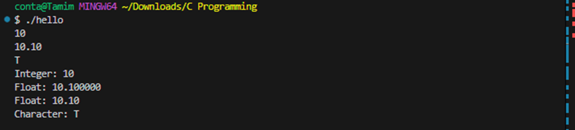
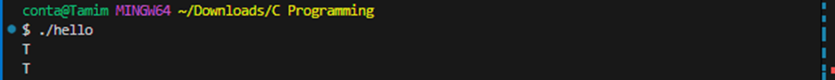
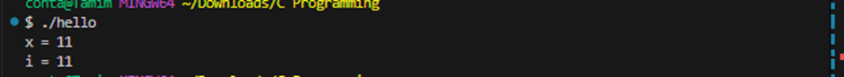
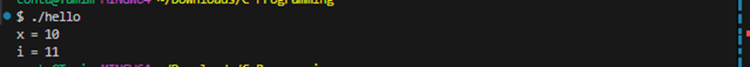
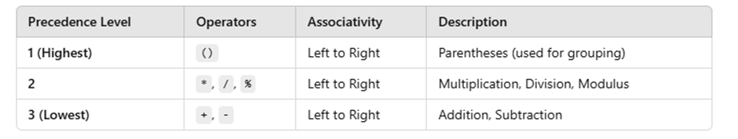

# C Programming Language

## Chapter 1: Basic Syntax, Variables and Data Types
- [1.1 History of Programming and Computer](#11-history-of-programming-and-computer)
- [1.2 History of C Programming Language](#12-history-of-c-programming-language)
- [1.3 First C Program](#13-first-c-program)
- [1.4 Comments](#14-comments)
- [1.5 Variables and Data Types](#15-variables-and-data-types)
- [1.6 How to Take Input in C](#16-how-to-take-input-in-c)
- [1.7 Pre and Post Increment](#17-pre-and-post-increment)
- [1.8 Operator Precedence in C](#18-operator-precedence-in-c)

## Chapter 2: Operators, Conditional Statements (if-else)
- [2.1 Arithmetic Operators: +, -, *, /, %](#21-arithmetic-operators----)
- [2.2 Relational Operators: >, <, >=, <=, ==, !=](#22-relational-operators----)
- [2.3 Logical Operators: &&, ||, !](#23-logical-operators---)
- [2.4 If Else](#24-if-else)
- [2.5 If Else Ladder](#25-if-else-ladder)
- [2.6 Nested If Else](#26-nested-if-else)

## Chapter 3: Loop
- [3.1 For Loop](#31-for-loop)
- [3.2 Break Statement](#32-break-statement)
- [3.3 Continue Statement](#33-continue-statement)
- [3.4 While and Do-While Loop](#34-while-and-do-while-loop)
- [3.5 Nested Loop](#35-nested-loop)

## Chapter 4: Introduction to Array
- [4.1 What is Array](#41-what-is-array)
- [4.2 Array Input and Output](#42-array-input-and-output)
- [4.3 Printing Reverse of an Array](#43-printing-reverse-of-an-array)
- [4.4 Reverse Array Element (Two Pointers Technique)](#44-reverse-array-element-two-pointers-technique)
- [4.5 Selection Sort](#45-selection-sort)
- [4.6 Sum of an Array](#46-sum-of-an-array)
- [4.7 Counting Array](#47-counting-array)
- [4.8 Sum of Two Values Equal x](#48-sum-of-two-values-equal-x)
- [4.9 Insert Element in Array](#49-insert-element-in-array)
- [4.10 Remove Element from an Array](#410-remove-element-from-an-array)
- [4.11 Array Concatenation](#411-array-concatenation)

## Chapter 5: 2D Array
- [5.1 What is 2D Array](#51-what-is-2d-array)
- [5.2 2D Array Input and Output](#52-2d-array-input-and-output)
- [5.3 Print Specific Row and Column in 2D Array](#53-print-specific-row-and-column-in-2d-array)
- [5.4 Different Types of Matrix](#54-different-types-of-matrix)

## Chapter 6: Introduction to String
- [6.1 What is String](#61-what-is-string)
- [6.2 String Input and Output](#62-string-input-and-output)
- [6.3 Length of a String](#63-length-of-a-string)
- [6.4 String Copy](#64-string-copy)
- [6.5 String Lexicographical Comparison](#65-string-lexicographical-comparison)
- [6.6 String Concatenation](#66-string-concatenation)
- [6.7 Counting/Frequency Problems](#67-countingfrequency-problems)

## Chapter 7: Function
- [7.1 What is Function](#71-what-is-function)
- [7.2 Return + Parameter](#72-return--parameter)
- [7.3 Return + No Parameter](#73-return--no-parameter)
- [7.4 No Return + Parameter](#74-no-return--parameter)
- [7.5 No Return + No Parameter](#75-no-return--no-parameter)
- [7.6 Useful Built-in Function](#76-useful-built-in-function)
- [7.7 Scopes in C](#77-scopes-in-c)

## Chapter 8: Recursion
- [8.1 Call Stack](#81-call-stack)
- [8.2 What is Recursion](#82-what-is-recursion)
- [8.3 Print 1 to 5 Using Recursion](#83-print-1-to-5-using-recursion)
- [8.4 Print 5 to 1 Using Recursion](#84-print-5-to-1-using-recursion)
- [8.5 Printing Array Using Recursion](#85-printing-array-using-recursion)
- [8.6 Length of String Using Recursion](#86-length-of-string-using-recursion)

## Chapter 9: Pointer
- [9.1 Pointers](#91-pointers)
- [9.2 Call by Value (Pass by Value)](#92-call-by-value-pass-by-value)
- [9.3 Call by Reference (Pointer Dereferencing)](#93-call-by-reference-pointer-dereferencing)
- [9.4 Array and Pointer Relationship](#94-array-and-pointer-relationship)
- [9.5 Pass Array into a Function](#95-pass-array-into-a-function)
- [9.6 Pass String into a Function](#96-pass-string-into-a-function)

---

# Chapter 1: Basic Syntax, Variables and Data Types

## 1.1 History of Programming and Computer
* **1837** = Charles Babbage conceptualized and designed the Analytical Engine, the first mechanical general-purpose computer. 
* **1843** = Ada Lovelace wrote an algorithm for the Analytical Engine. Her algorithms introduced foundational programming concepts such as loops, conditional branching, and the idea of data storage, earning her recognition as the world's first computer programmer.

## 1.2 History of C Programming Language
* **1958 (AlGOL)** = ALGOL (Algorithmic Language) was developed as a structured programming language, influencing the development of many modern languages, including C, particularly in concepts like block structure and nested functions.
* **1966 (BCPL)** = BCPL (Basic Combined Programming Language) was developed for system-level programming. It influenced the creation of B, which was a direct precursor to C.
* **1070 (B)** = B is a simpler version of BCPL. It was created at Bell Labs for early UNIX OS development but lacked essential data types and structures, which limited its ability to handle more complex software development.
* **1972 (C)** = C was developed by Dennis Ritchie at Bell Labs to rewrite the UNIX operating system. Its design made it portable across different hardware platforms, and it became one of the most influential languages in software development.

## 1.3 First C Program
```c
#include <stdio.h>
int main() {
    printf("Hello, World!");

    return 0;
}
```
After writing the program open vs code terminal and type: 



### Behind the code:

1. **Directives**: Directives are special instructions for the preprocessor that start with a # symbol.

    **Some common directives:**

    * `#include` = Includes the contents of another file into the current file,     often used to include header files.
    * `#define` = Define a macro.

2. **Macros**: Macros are special types of directives that allow you to define constants or reusable code snippets that defined using the #define directives. 

example: 
```c
#include <stdio.h>
#define PI 3.1416

int main()
{
    printf("Value of PI: %.4f", PI);

    return 0;
}
```



3. **Preprocessor:** Preprocessor is a tool or step in the compilation process that handles directives and macros before the actual compilation begins.

    Key features of the preprocessor: 
    * It runs automatically before the compiler.
    * It removes comments and expands macros.

    What the Preprocessor Does:
    - Reads the directives (Lines starting with `#`) in the source code.
    - Modifies the code as per the directives and expands macros.
    - Produces the preprocessed source code that is then passed to the compiler.

4. **Header File:**
   A header file in C is a file with a `.h` extension that contains reusable code, such as function declarations, constants, variables, and data types. You can include it in your program using the `#include` directive.

   Some Common Header Files in C:
   - `stdio.h` – Standard Input/Output functions
   - `stdlib.h` – Memory allocation, process control, conversions
   - `math.h` – Mathematical functions
   - `string.h` – String handling functions
   - `stdbool.h` – Boolean data type (true, false, bool)

5. **main function():**
   The `main()` function is the entry point of every C program. You must include the `main()` function once in your code for the program to work. No matter where you write the `main()` function, when the C program runs, it finds the `main()` function first and starts executing from there.

6. **printf() Function:**
   The `printf()` function is a predefined function. If you want to use this function, you have to include our standard input and output header or library file (`stdio.h`).

## 1.4 Comments:

```c
#include <stdio.h>

int main()
{
    // This is a single line comment
    /*
        This is a
        Multiline
        Comment
    */

    return 0;
}
```

## 1.5 Variables and Data Types:

### Data Types: 
1. **int**: - 4, -3, -2, -1 ,0 ,1 ,2 ,3 ,4 --- `%d` (Format Specifier)
2. **long long int**: - 4, -3, -2, -1 ,0 ,1 ,2 ,3 ,4 --- `%lld`
3. **float**: -4.53, -3.45, 1.5, 3.1416 --- `%f`
4. **double**: -4.53, -3.45, 1.5, 3.1416 --- `%lf` 
5. **char**: ‘1’, ‘5’, ‘A’, ‘@’, --- `%c`
6. **bool**: true(1) or false(0)

### Data Types Limitations in C:

- **Int** = 10^9 = it allows up to approximately 10 digits
- **long long int** = 10^18 = it allows up to approximately 19 digits
- **float** = 10^6 = it allows up to approximately 7 digits precision (1.123456 = 7 digits)
- **double** = 10^14 = it allows up to approximately 15 digits precision
- **char** = -128 to 127

### Variable: Who store Data Types.

### Variable Declaration:

```c 
int a; 
```
### Variable initialization:
```c
int a = 30;
```
### Variable assignment:
```c
a = 40;
```
**Note**: initialization gives a variable its first value, while assignment gives a variable a new value after it has been initialized.

**Example:**
```c
#include <stdio.h>
#include <stdbool.h>

int main()
{
    int myInt = 2147483647;
    long long int myLongLongInt = 9223372036854775807;
    float myFloat = 1.123456;
    double myDouble = 1.12345678912345;
    char myChar = 'a';
    bool myBool = true;

    printf("myInt: %d\n", myInt);
    printf("myLongLongInt: %lld\n", myLongLongInt);
    printf("myFloat: %f\n", myFloat);
    printf("myFloat: %.2f\n", myFloat);
    printf("myDouble: %.15lf\n", myDouble);
    printf("myChar: %c\n", myChar);
    printf("myBool: %d\n", myBool);

    return 0;
}
```


## 1.6 How to take input in c
```c
#include <stdio.h>
int main()
{
    int myInt;
    float myFloat;
    char myChar;

    scanf("%d", &myInt); // & = address of operator or ampersand operator
    scanf("%f", &myFloat);
    scanf(" %c", &myChar); //The space before %c to consume any leftover newline character

    printf("Integer: %d\n", myInt);
    printf("Float: %f\n", myFloat);
    printf("Float: %.2f\n", myFloat);
    printf("Character: %c\n", myChar);

    return 0;
}
```


### Some common input and output function:

1. `scanf()` -- `printf()`

2. `getchar()` -- `putchar()` = `getchar()` reads a single character, and `putchar()` prints a single character.

**Code:** 
```c
#include <stdio.h>
int main()
{
    char myChar;
    myChar = getchar();
    putchar(myChar); // Output the character read from input

    return 0;
}
```


**Note:** <br>
We cannot directly call the getchar() function. Instead, we must assign the getchar() function to a variable. 
We are not allowed to add any additional text inside the putchar() function and The putchar() function must strictly be used to print a single character.

## 1.7 pre and post increment:
```c
#include <stdio.h>
int main()
{
    int i = 10;
    int x = ++i;
    // ------------->

    printf("x = %d\n", x);
    printf("i = %d", i);

    return 0;
}
```


**Note:** <br> 
Here, i is incremented to 11 first, and then this new value is assigned to x. Both i and x are 11 after this operation.

**Post Increment**
```c
#include <stdio.h>
int main()
{
    int i = 10;
    int x = i++;
    // ------------->

    printf("x = %d\n", x);
    printf("i = %d", i);

    return 0;
}
```


**Note:** <br> 
First, the value of `i` (which is 10) is assigned to the variable `x`. After that, `i` is incremented, so `i` becomes 11.

**Note:**
- **Pre-increment (`++i`)**: First increments the value of `i`, then assigns it.
- **Post-increment (`i++`)**: First assigns the value, then increments `i`.

## 1.8 Operator Precedence In C:


So, if you write an expression like:  
`int result = 10 + 5 - 2 / 2 * 3;`  

Step-by-step evaluation:  
10 + 5 – 1 * 3  
10 + 5 – 3  
15 – 3  
12  

Final result = 12
